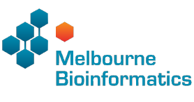

## Project outline

Through a licence agreement with Seqera Labs, Australian BioCommons is in the process of standing up a national Nextflow Seqera service, enabling a centralised command post for Nextflow pipelines to be offered as a fully subsidised service for Australian researchers.

Working with partners including service hosts Pawsey Supercomputing Research Centre, NCI, SIH, QCIF and Melbourne Bioinformatics, the Australian Nextflow Seqera Service will deliver a key component of BioCommon’s vision for an ecosystem of data analysis and digital asset stewardship platforms. The project is delivered through the BioCommons ‘Bring Your Own Data’ Project, which attracts ARDC and Bioplatforms Australia funding.

## Aims of the pilot project

The pilot project has three key ambitions, which are to

1. Establish a service where BioCommons early adopters, including both science and method communities, can easily run, manage and monitor the execution of Nextflow workflows on dedicated compute infrastructure.

2. Understand service demand and utilisation by working with BioCommons communities and assessing interest from other communities

3. Develop service operational models; understand costs and benefits; develop a business case for continuing the service

At the end of the pilot phase, the Australian BioCommons will make the decision on providing this service for a long term. This depends on the feedback and outcomes of this pilot project. Successful use cases will play a major role in influencing the decision.

## Service status

Since investigations commenced in July 2022:

- Nextflow Seqera has been deployed on Pawsey infrastructure

- Researchers at AGRF, AusARG, UNSW and the University of Sydney are developing and running Nextflow pipelines to test the service

- Test pipelines have been run on Pawsey, NCI, AGRF and AWS infrastructure.

- Research infrastructure teams at QUT and St Vincent’s institute medical research are exploring the use of the service

  

## Participants of the pilot project

  

    

      

        <h5 class="card-title">AGRF Bioinformatics Team</h5>
        
Australian Genome Research Facility

        <a href="https://www.agrf.org.au/" class="btn btn-primary">Website</a>
      

    

  

  

    

      

        <h5 class="card-title">AusARG Phylogenomics Group</h5>
        
Australian Amphibian and Reptile Genomics

        <a href="https://ausargenomics.com/" class="btn btn-primary">Website</a>
      

    

  

  

    

      

        <h5 class="card-title">AusARG Phylogenomics Group</h5>
        
Australian Amphibian and Reptile Genomics

        <a href="https://ausargenomics.com/" class="btn btn-primary">Website</a>
      

    

  

  

    

      

        <h5 class="card-title">AusARG Phylogenomics Group</h5>
        
Australian Amphibian and Reptile Genomics

        <a href="https://ausargenomics.com/" class="btn btn-primary">Website</a>
      

    

  

## Quick access links

[Join the pilot project](/nextflow-seqera/main/join_us){: class="btn btn-primary col-3"}

   

   

   

    

        

        

        

        

    

    

        

        

        

        

    

