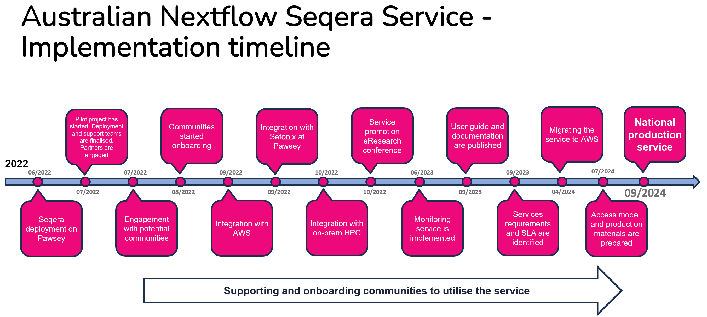

## Project outline

Through a licence agreement with Seqera Labs, Australian BioCommons piloted a national Nextflow Seqera service, enabling a centralised command post for Nextflow pipelines to be offered as a fully subsidised service for Australian researchers.

Working with pilot partners including service hosts Pawsey Supercomputing Research Centre, NCI, SIH, QCIF and Melbourne Bioinformatics, the Australian Nextflow Seqera Service will deliver a key component of BioCommon’s vision for an ecosystem of data analysis and digital asset stewardship platforms.



## Project timeframe

The pilot project began in **July 2022** and finished in **September 2024**.

## Aims of the pilot project

The pilot project had three key ambitions:

1. Establish a service where BioCommons early adopters, including both science and method communities, can easily run, manage and monitor the execution of Nextflow workflows on dedicated compute infrastructure.

2. Understand service demand and utilisation by working with BioCommons communities and assessing interest from other communities.

3. Develop service operational models; understand costs and benefits; develop a business case for continuing the service.

At the end of the pilot phase, Australian BioCommons will make the decision on providing this service for a long term. This depends on the feedback and outcomes of this pilot project. Successful use cases will play a major role in influencing the decision.

## Pilot project outcomes

Since investigations commenced in July 2022 till the end of the pilot project in September 2024:

- Nextflow Seqera was deployed on Pawsey infrastructure

- 29 research groups were onboarded to the service (78 users from 16 different institutions).

- The services were successfully integrated with our partner's compute infrastructure such as NCI, Pawsey, on premises HPC, AWS and Azure 

- More than 334,000 jobs have been submitted to several compute infrastructures to perform 4,050 workflow executions. 

- Supported many groups with workflow development and deployment
- Established a user guide

- Promoted the service at several conferences

 

 

 

## Participants of the pilot project

    

        

            

            

                <h5 class="card-title">AGRF Bioinformatics Team</h5>
                
Australian Genome Research Facility

                <a href="https://www.agrf.org.au/" class="btn btn-primary">Website</a>
            

            

        

        

            

            

                <h5 class="card-title">AusARG Phylogenomics Group</h5>
                
Australian Amphibian and Reptile Genomics

                <a href="https://ausargenomics.com/" class="btn btn-primary">Website</a>
            

            

        

        

            

            

                <h5 class="card-title">Zero Childhood Cancer</h5>
                
Children's Cancer Institute

                <a href="https://www.zerochildhoodcancer.org.au/" class="btn btn-primary">Website</a>
            

            

        

    

    

        

            

            

                <h5 class="card-title">eResearch Team</h5>
                
Queensland University of Technology

                <a href="https://www.qut.edu.au/" class="btn btn-primary">Website</a>
            

            

        

        

            

            

                <h5 class="card-title">Data Science Platform</h5>
                
Garvan Institute of Medical Research

                <a href="https://www.garvan.org.au/research/platforms/data-science/" class="btn btn-primary">Website</a>
            

            

        

        

            

            

                <h5 class="card-title">Northcott Neuroscience Laboratory</h5>
                
ANZAC Research Institute

                <a href="https://slhd.health.nsw.gov.au/concord-hospital-research/neurobiology-molecular-medicine/" class="btn btn-primary">Website</a>
            

            

        

    

    

        

            

            

                <h5 class="card-title">Bioinformatics Consulting Core Facility </h5>
                
Peter MacCallum Cancer Centre

                <a href="https://www.petermac.org/research/research-technologies/bioinformatics" class="btn btn-primary">Website</a>
            

            

        

        

            

            

                <h5 class="card-title">South Australian Genomics Centre</h5>
                
SAHMRI (South Australian Health and Medical Research Institute)

                <a href="https://sa-genomics.com.au/" class="btn btn-primary">Website</a>
            

            

        

        

            

            

                <h5 class="card-title">P4 Respiratory Health for Kids</h5>
                
Telethon Kids Institute

                <a href="https://slhd.health.nsw.gov.au/concord-hospital-research/neurobiology-molecular-medicine/" class="btn btn-primary">Website</a>
            

            

        

    

    

        

            

            

                <h5 class="card-title">University of Melbourne Centre for Cancer Research </h5>
                
University of Melbourne

                <a href="https://mdhs.unimelb.edu.au/centre-for-cancer-research" class="btn btn-primary">Website</a>
            

            

        

        

            

            

                <h5 class="card-title">Sydney Informatics Hub</h5>
                
The University of Sydney

                <a href="https://www.sydney.edu.au/research/facilities/sydney-informatics-hub.html" class="btn btn-primary">Website</a>
            

            

        

        

            

            

                <h5 class="card-title">UWA ForrestLab</h5>
                
The Harry Perkins Institute of Medical Research

                <a class="btn btn-primary">Website</a>
            

            

        

    

    

        

            

            

                <h5 class="card-title">Multiple groups from WEHI </h5>
                
Walter and Eliza Hall Institute of Medical Research

                <a href="https://www.wehi.edu.au/" class="btn btn-primary">Website</a>
            

            

        

        

            

            

                <h5 class="card-title">Queensland Cyber Infrastructure Foundation (QCIF) </h5>
                
The University of Queensland

                <a href="https://www.qcif.edu.au/" class="btn btn-primary">Website</a>
            

            

        

    

   

