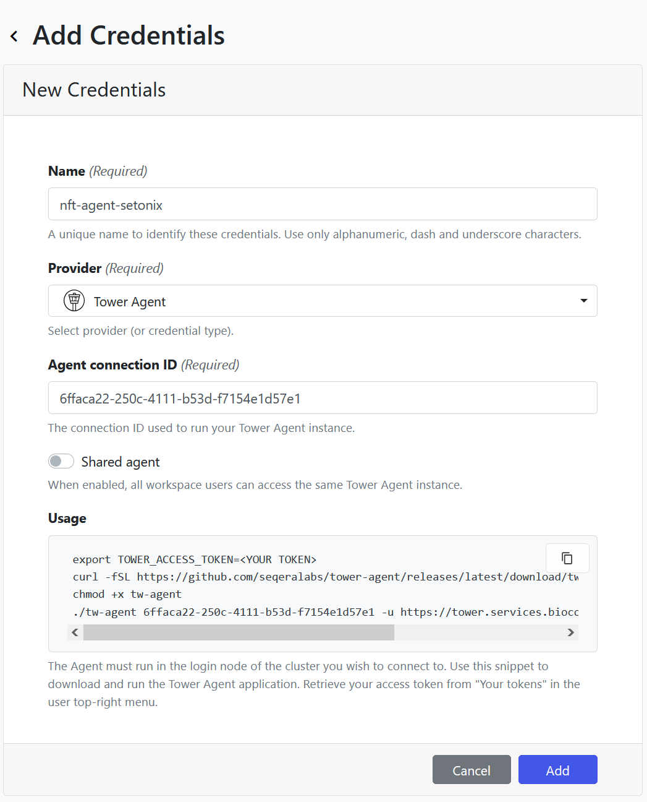
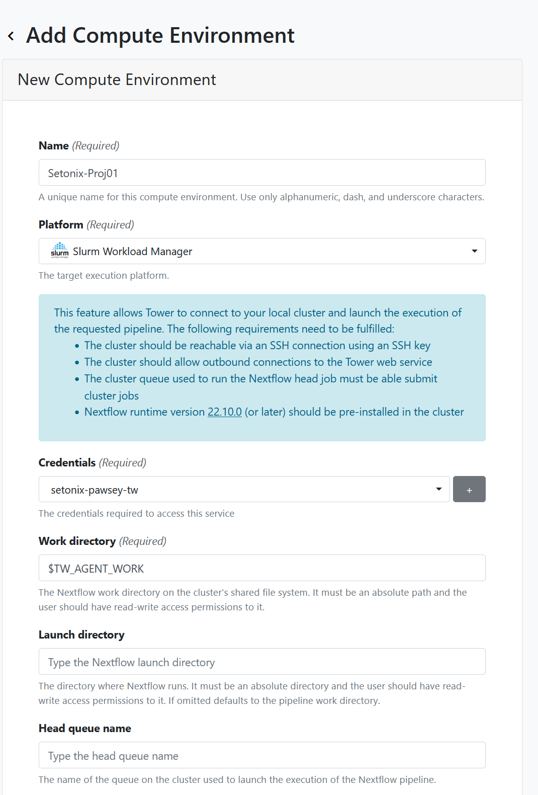

## Introduction

Seqera supports running pipelines on several compute platforms including commercial cloud such as AWS and Azure, as well as high-performance computers (HPC). A full list of supported platforms is available in [Seqera's documentation](https://docs.seqera.io/platform/latest/compute-envs/overview/). 

To access these compute infrastructures through Seqera, compute environments need to be created and configured on Seqera for each compute infrastructure.

## Configuring HPC on the Australian Nextflow Seqera Service

Seqera supports adding compute environments for HPCs that utilise [Slurm](https://docs.seqera.io/platform/latest/compute-envs/slurm/) and [PBS Pro](https://docs.seqera.io/platform/latest/compute-envs/altair-pbs-pro/) workload managers. 

> Note: Compute environments are shared across all users of the same workspace. 

In order to access compute infrastructre, you need to create access [credentials](https://docs.seqera.io/platform/latest/credentials/overview/#introduction). SSH keys or Tower Agents can be used to access the HPC. SSH keys are easier to use but some HPC providers are restricted from sharing SSH keys with a third party (i.e. Seqera Platform). In addition, it can be tricky to use SSH keys if the HPC is within a private network and requires VPN access. 

The following instructions are to configure compute environments for HPC through Tower agent credentials.

### Steps to configure HPC on the Australian Nextflow Seqera Service within an organisation workspace

Prerequisites for configuration on an organisation workspace:

1.	You have access to an organisation workspace
2.	You have an owner or administrator role within this workspace.

The following steps need to be completed in order unless they have been completed before and are to be reused.

1.	Create Personal Token
2.	Create Tower Agent credentials
3.	Configure the compute infrastructure

**Detailed Instructions:**

    

        <h2 class="accordion-header" id="heading-access-token" style="margin-top:0rem">
          <button class="accordion-button collapsed" type="button" data-bs-toggle="collapse" data-bs-target="#collapse-access-token" aria-expanded="false" aria-controls="collapse-access-token">
            Create Personal Token
          </button>
        </h2>
        

          
  
            You don’t need an access token if you intend to create SSH key credentials, but you will need it for the Tower Agent credentials. 
            <ul>
            <li>The user can create an access token as <a href="https://docs.seqera.io/platform/latest/api/overview/?h=access+token#authentication"> described here</a>.</li>
            <li>Keep it safe, create a new one if you lose it and delete lost tokens.</li>
            <li>Use descriptive names.</li>
            <li>Don’t share your token with others.</li>
            <li>After you close the token creation window, you will not be able to view/copy the token any more, but you can update it or delete it.</li>
            </ul>
            

            <h4 class="alert-heading">Note</h4>
            
The same personal access token can be used with multiple Tower agents, however, we recommend creating one access token for each credential or at least for each compute infrastructure.

            

          

        

    

    

        <h2 class="accordion-header" id="heading-tower-agent" style="margin-top:0rem">
          <button class="accordion-button collapsed" type="button" data-bs-toggle="collapse" data-bs-target="#collapse-tower-agent" aria-expanded="false" aria-controls="collapse-tower-agent">
            Creating Tower Agent credentials
          </button>
        </h2>
        

          

            
<a href="https://docs.seqera.io/platform/latest/credentials/agent_credentials">Tower Agent</a> is software that runs on the HPC and communicates with the Seqera API to perform all tasks needed on the HPC, including launching a pipeline and monitoring its execution. For an admin to create a tower agent credential, follow these steps:

            <ol>
                <li>Navigate to the workspace you want to add credentials to, then click on the <code>Credentials</code> tab.</li>
                <li>Click on the <code>Add Credentials</code> button under <code>Credentials</code> to create a shared <code>Agent connection ID</code> for the Tower Agent.</li>
                <li>A wizard interface will appear, with some scripts in the <code>Usage</code> box and fields to complete.</li>
                 
                

                 
                <li>Give your credential a descriptive name, this is working at the infrastructure level so we recommend creating different credentials for different environments.</li>
                <li>Keep <code>Shared agent</code> disabled. Check <a href="/user-guide/shared-agent.md">the shared agent section</a> of this guide for more details.</li>
                <li>Before adding the credential you will need to run the agent on the compute infrastructure. To do this:
                    <ol>
                        <li>Keep the Agent interface open.</li>
                        <li>Log in to infrastructure (the HPC).</li>
                        <li>In theory, you can run the Agent from anywhere on the HPC. See our [best practices](/user-guide/hpc-recommendations) for some recommendations.</li>
                        <li>Copy the usage script from the Agent interface to any text editor and edit the access token to provide your own token created above and provide the path to the work directory for the Agent.</li>
                        <li>The work directory for the Agent (provided as a parameter in the command) must exist before running the Agent.</li>
                        <li>Run the edited script relevant to your infrastructure (PBS or SLURM) bash.</li>
                        <li>This script will download the Tower Agent script to the current work directory on the HPC and make it executable.</li>
                        <li>Then, it runs the Agent by providing the connection id and access token.</li>
                        <li>You can see the Agent running on the terminal. Keep it running.</li>
                        <li>Back in the Seqera interface, click <code>Add</code> to save your credential.</li>
                    </ol>
                </li>
            </ol>
            
The steps above will help to create the credentials and understand the Agent&rsquo;s parameters and how it runs. In practice, this can be better optimised by having all scripts and tokens in config files and bash scripts. See [best practice recommendations](/user-guide/hpc-recommendations). The procedure is also described in the Seqera documentation at <a href="https://docs.seqera.io/platform/latest/credentials/agent_credentials">Quick Start</a>.

            

            <h4 class="alert-heading">Note</h4>
            
Users of the same workspace share credentials, so there is no need to create a credential per user within a workspace.

            

            
You might need to create multiple credentials for different compute environments. For example, credentials for your institutional HPC and another credential for AWS account or another national HPC.

            

          

        

    

    

        <h2 class="accordion-header" id="heading-cop-env" style="margin-top:0rem">
          <button class="accordion-button collapsed" type="button" data-bs-toggle="collapse" data-bs-target="#collapse-cop-env" aria-expanded="false" aria-controls="collapse-cop-env">
            Configuring compute environment 
          </button>
        </h2>
        

          

            <ol>
                <li>Navigate back to the launchpad page for the workspace you want to add a compute environment to.</li>
                <li>Select the Compute Environments tab in the top navigation bar </li>
                <li>Select <code>Add Compute Environment</code> button </li>
                <li>Give the environment a name
                    <ul>
                        <li>Make it as descriptive as you like</li>
                        <li>For HPC you may wish to configure different compute environments for different project codes, so you could include this in the environment name to easily identify it. For example, specify the name of the HPC and the relevant project code</li>    
                    </ul>                   
                     
                    

                     
                </li>
                <li> Select a platform 
                    <ul>
                        <li> This will depend on which infrastructure you are running and what workload managers are available there.</li>
                        <li>Examples: For Setonix - SLURM, for Gadi - PBSpro.</li>
                    </ul>
                </li>
                <li>Select workdirectory 
                    <ul>
                        <li>This can remain as <code>$TW_AGENT_WORK</code> or specify your own</li>
                    </ul>
                </li>
                <li>Leave the launch directory field empty.</li>
				<li>Provide the launch and compute queue (as available on the HPC).
                    <ul>
                        <li>We recommend using a queue with long wall time for the launch queue as this is dedicated to the nextflow main process that should run for the whole time of the pipeline execution. </li>
                        <li>Compute queue will be used for the tasks of the pipeline so we recommend using the default queue on the HPC.</li>
                        <li>The compute queue can be reconfigured during the execution through the pipeline configuration options.</li>
                    </ul>
                </li>
                <li>Select staging options. Under Pre-run script:
                    <ul>
                        <li>Here you can provide all commands to be executed on the HPC before launching the pipeline including module loading.</li>
                        <li>Usually you will need to load Nextflow, singularity, conda, awscli .. if any of them will be used.</li>
                    </ul>
                </li>
                <li>Specify advanced options
                    <ul>
                        <li>Under head job submit options add project specific and queue data. This configuration is for the job that runs the main nextflow process.</li>
                        <li>It is recommended to use 2 CPUs and 8 GB memory for this job.</li>
                        <li>Apply head job submit options to compute jobs to ensure your account details get passed on.</li>
                    </ul>
                </li>
                <li>Click on <code>Add</code> and the compute environment will be created.</li>
            </ol>
		  

		

	

### Utilising compute environment with Tower Agent

There are a few points to be considered when using Tower Agent:

1. The users of a workspace will share the same compute environment and credentials.
2. Each user needs to create their own personal access token.
3. Each user needs to run Tower Agent on their account on the HPC.
4. Each user needs to pass their personal access token and the shared connection id (of the credential) to their instance of Tower Agent on the HPC.

To do that:

1. Create a personal access token or use a pre-created access token as described here (access1).
2. Obtain the connection id for the compute environment from its credential page (conn_id).
3. Run Tower Agent using access1 and conn_id, and an independent work directory (any directory you have access to).
4. The compute environment will be available and usable as long as the agent is running.

    <h4 class="alert-heading">Note</h4>
     
Tower Agent does not support service accounts on the HPC. In other words, you can not use one Agent for multiple users.

     

     
The Agent should be able to access the internet.

## Configuring commerical cloud

The easiest way is using AWS Batch and Batch Forge permissions to allow tower to create the batch environment. In order to do this please follow this [documentation](https://docs.seqera.io/platform/latest/compute-envs/aws-batch/).

## Other infrastructures

Please visit [Seqera documentation](https://docs.seqera.io/platform/latest/compute-envs/overview/) for more details on configuring for other compute infrastructures such as Azure.
 
