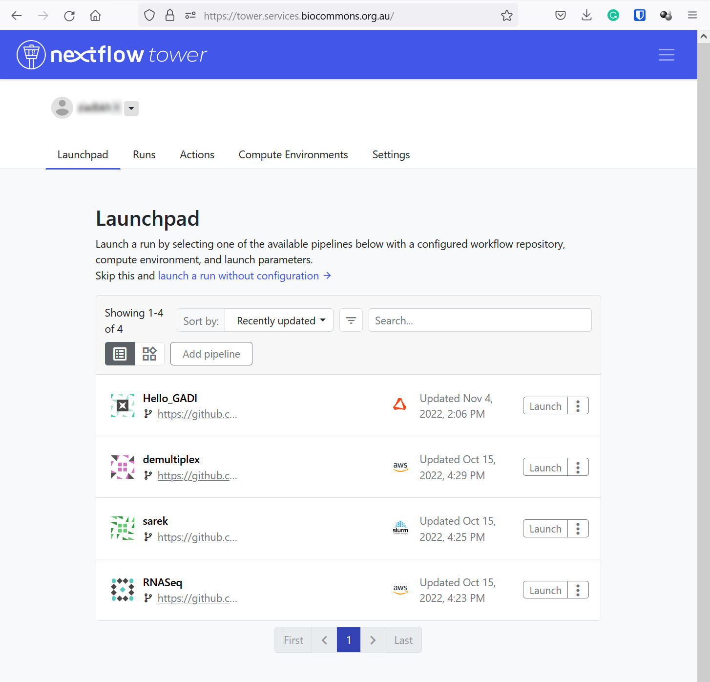

## Logging into the service

1. Go to [https://seqera.services.biocommons.org.au](https://seqera.services.biocommons.org.au).

2. Provide an email address, then you will receive an email with the access link in your email inbox.

3. Click the workspace dropdown menu at the top left of the page with your name to navigate between your personal and organisation workspaces.

